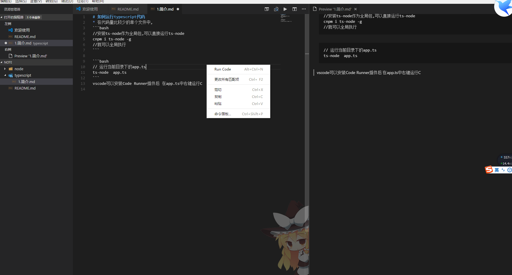

# 如何运行typescript代码
* 在代码量比较少的单个文件中,ts-node
```bash
# 安装ts-node作为全局包,可以直接运行ts-node 就可以全局执行 
cnpm i ts-node -g 
# 运行当前目录下的app.ts
ts-node  app.ts 
```
vscode可以安装Code Runner插件后 在app.ts中右键运行 Run Code

* 我的